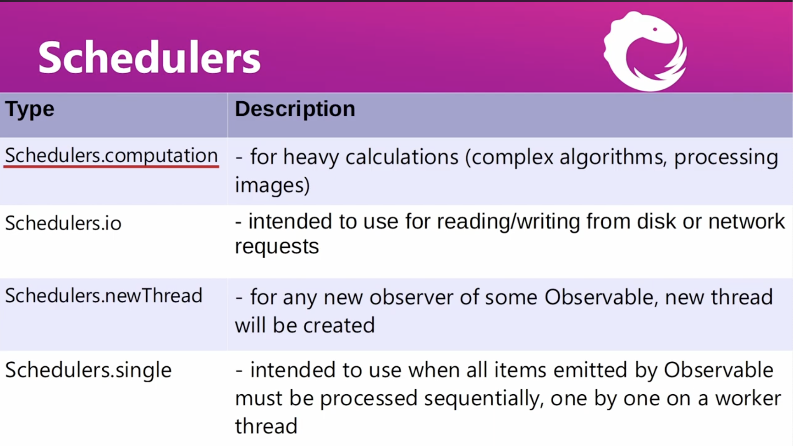

# RxJava Documents

## Observe Type

### Observable
There's many type to create observable 
- Just
- Iterable
- Range
- Interval
- Time

For the example is available [here](ObservableDocs.java)

### Single
This type will expect has only one item.

For the example is available [here](SingleDocs.java)

### Maybe
This type will expect one or no item.

For the example is available [here](MaybeDocs.java)

### Completable
Used for operation which doesn't return any value.

For the example is available [here](CompletableDocs.java)

The summary and differentiate of observe type is like this

## Flowable

There's example and differentiate of observable and flowable

- Synchronous Observable
- Asynchronous Observable
- Asynchronous Flowable

For the example is available [here](FlowableDocs.java)

## HotColdObservable
This is the file docs [link](HotColdObservableDocs.java)
- Cold Observable
- Hot Observable

## Disposable
For the example is available [here](DisposableDocs.java)

## Filtering and Conditional
For the example is available [here](OperatorDocs.java)

- Filter
- Take
- Skip
- Distinct
- First
- Last
- TakeWhile
- SkipWhile
- All
- Any
- DefaultIfEmpty
- SwitchIfEmpty

## Transforming and Combining
For the example is available [here](TransformCombineDocs.java)

- Map
- Sorted
- Scan
- Buffer
- GroupBy
- FlatMap 
- ToList
- MergeWith
- ZipWith

## Utility and Error
For the example is available [here](UtilityDocs.java)

- Delay
- Timeout
- ObserveOn
- SubscribeOn
- DoOnNext
- DoOnDispose
- Retry
- OnErrorReturnItem
- OnErrorResumeWith

## Subject
For the example is available [here](SubjectDocs.java)

- PublishSubject
- BehaviorSubject
- ReplySubject
- AsyncSubject

## Custom Operator
For the example is available [here](CustomOperatorDocs.java)

## Threading
For the example is available [here](ThreadingDocs.java)

- SubscribeOn
- ObserveOn

This is the type of schedulers
